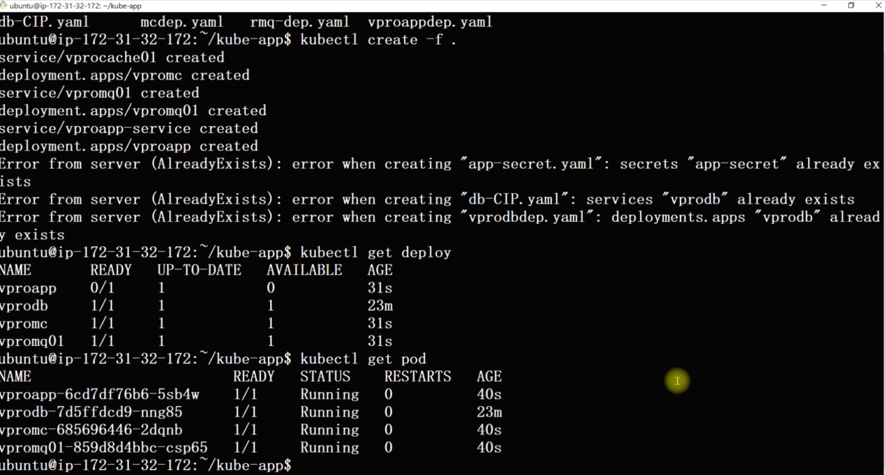
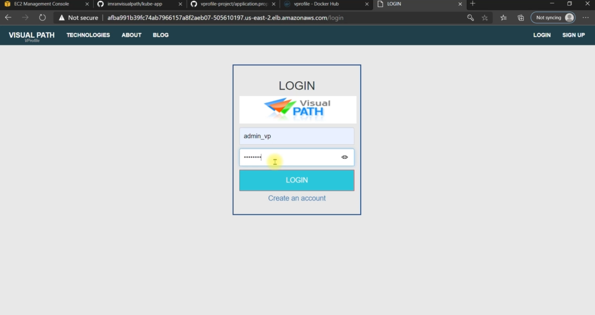
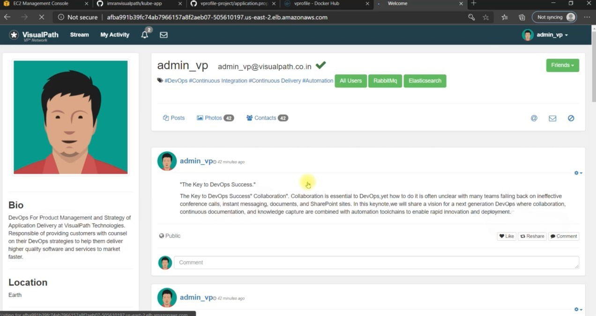
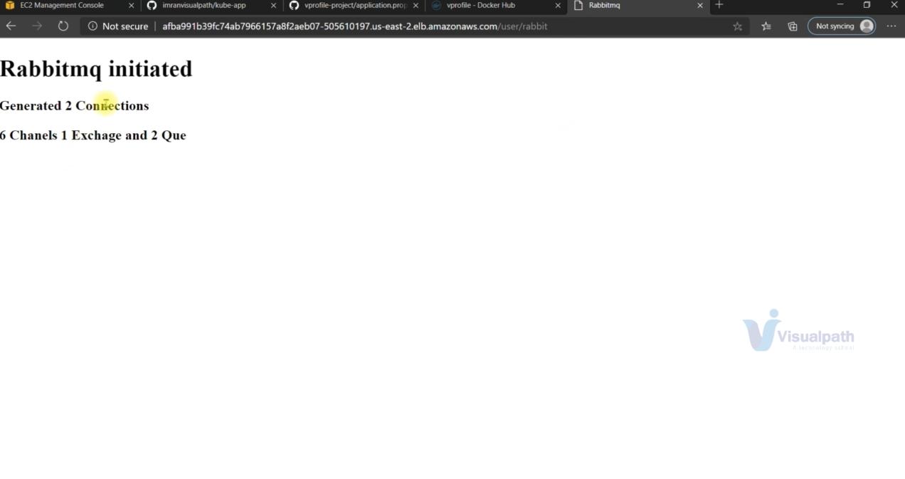
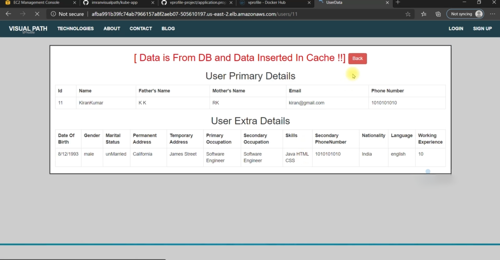

#  Java App Deployment on Kubernetes Cluster

This project demonstrates how to containerize a Java web application and deploy it to a **Kubernetes cluster** using `deployment.yaml` and `service.yaml`. The app runs on a Tomcat server and is accessible via a NodePort service.

---

# Tools & Technologies Used

- Java (Maven)
- Docker
- Kubernetes (Minikube or k3s)
- kubectl
- Tomcat 8
- GitHub

---

## 📸 Screenshots

## ✅ Kubernetes Service Created

## ✅ Java App Login Page

## ✅ Java App After Login

## ✅ RabbitMQ Dashboard

## ✅ Memcached Status Page

